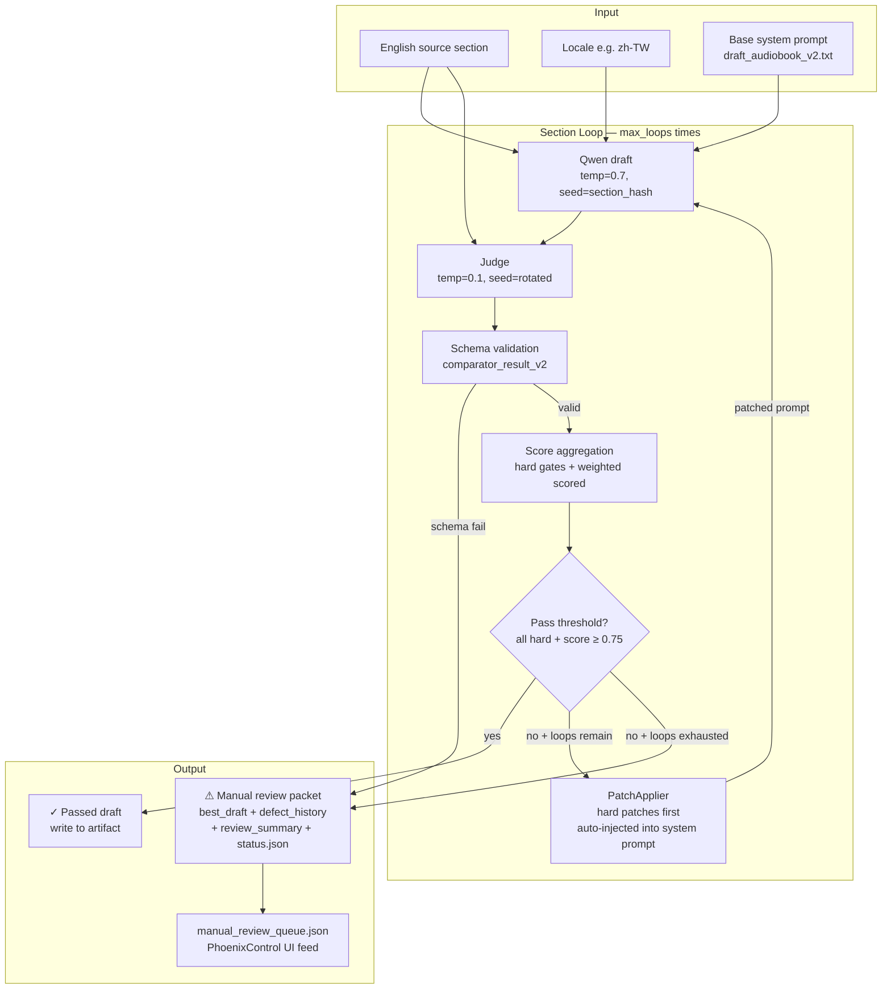

# Audiobook Pipeline Spec
## Qwen-Only Comparator Loop — v2.0

**Status:** Architecture complete. API wiring, prompts, golden set pending. See §12 Gap Tracker.
**Authority:** This document is the single canonical reference for the Qwen-Only Audiobook Pipeline. All design decisions flow from here. Config files, schema, and scripts implement what is specified here.
**Last updated:** 2026-03-06
**Related files:**

| File | Role |
|------|------|
| `config/audiobook_script/static_polish_rubric.yaml` | Step 0: rubric rules (authored offline, never runtime) |
| `config/audiobook_script/comparator_config.yaml` | All runtime parameters |
| `config/audiobook_script/comparison_checklist_v2.yaml` | 9 gate definitions |
| `schemas/comparator_result_v2.schema.json` | Judge output contract |
| `scripts/audiobook_script/run_comparator_loop.py` | Full pipeline implementation |
| `docs/GO_LIVE_FINAL_CHECKLIST.md` | 10-item production go-live gate |

---

## §1 Purpose and Non-Goals

### What this system does

Takes an English audiobook section and produces a native-language version that passes a structured quality checklist — without Claude at runtime and without a human reviewing each step.

The pipeline runs Qwen to generate a translated/localized draft, runs a judge to compare it against the English source, and if the draft fails any gate, automatically assembles a patch from the judge's verdict and reruns Qwen. This repeats up to `max_loops` times (default 3). If the section passes, the draft is kept. If it exhausts all loops without passing, it writes a complete review packet and routes to the manual review queue.

### What it is not

It is not a translation system in the classical sense — it is a localized audiobook authoring system. The goal is not a faithful literal translation but a native-speaker audiobook experience that preserves the source's meaning, emotional arc, and safety framing while sounding completely natural in the target locale.

It does not use Claude at runtime. Claude's contribution is locked into the static polish rubric (`static_polish_rubric.yaml`), which was authored once offline and is enforced by the judge as a checklist. No Claude API call happens during a production run.

It does not involve humans in the repair loop. Every patch application, loop decision, and routing decision is automated.

---

## §2 System Context

This pipeline sits downstream of the English book production pipeline and upstream of the TTS render step.

```
English book assembly (Phoenix/Pearl Prime)
        │
        ▼
  English section text
        │
        ▼
  Audiobook Comparator Loop   ◄── this spec
        │
   pass │  manual_review
        │        │
        ▼        ▼
  Localized    Manual review queue
  draft text   (PhoenixControl UI)
        │
        ▼
  TTS render (ElevenLabs / Google Neural2)
        │
        ▼
  Published audiobook
```

The unit of work is a **section** — one contiguous segment of the audiobook (typically a chapter or a major sub-section). Sections within a book are independent and processed in parallel.

---

## §3 Full End-to-End Flow



### Step-by-step

**1. Qwen draft.** The English source section plus the draft system prompt are sent to Qwen (`qwen-max`, temperature 0.7, seed derived from `hash(section_id + locale)`). The same section+locale always gets the same seed — this makes runs deterministic and debuggable. The base system prompt tells Qwen: locale, register, glossary constraints, output format.

**2. Judge call.** The English source, the Qwen draft, and the full gate checklist are sent to the judge (`qwen-max`, temperature 0.1, seed `hash(section_id + loop_index + "JUDGE_SALT_V2")`). The judge uses a completely separate system prompt. Temperature 0.1 makes judge verdicts near-deterministic — the same draft gets the same verdict on replay.

**3. Schema validation.** The judge's raw output is parsed as JSON and validated against `schemas/comparator_result_v2.schema.json`. The `checklist_schema_version` field on every gate result must match `2.0.x`. Any schema failure immediately routes the section to manual review — never a silent pass.

**4. Score aggregation.** Hard gates are evaluated for pass/fail. Scored gates produce a weighted score. The aggregate is `scored_total / max_scored_total`. A section passes only when: all hard gates are `pass=true` AND `aggregate_score >= threshold` (default 0.75, locale-overridable).

**5. Decision.** If the section passes, the draft is kept. If it fails and loops remain, `PatchApplier` builds the next system prompt. If it fails and all loops are exhausted, it routes to manual review. Auto-pass on exhaustion is architecturally impossible — there is no code path that returns a passed draft without the score threshold being met.

**6. Patch injection.** `PatchApplier` collects all failed gates' `prompt_patch` strings, sorts them (hard gate failures first by `gate_id`, then scored failures by weight descending), and appends them to the original system prompt as a `## REVISION INSTRUCTIONS (Loop N)` block. The assembled prompt is hashed and stored as `rerun_prompt_hash` in the artifact trace. The patch block is capped at ~600 tokens; if it overflows, scored patches are trimmed but hard gate patches are always preserved.

**7. Artifact trace.** Every loop pass writes a `trace.json` to `artifacts/audiobook/{batch_id}/{book_id}/{section_id}/loop_{n}/`. The trace contains: `input_draft_hash`, `judge_result_json`, `prompt_patch`, `rerun_prompt_hash`, `aggregate_score`, `hard_gates_passed`, `final_decision`, `timestamp_utc`. An append-only JSONL entry is also written to `artifacts/audiobook/loop_decisions.jsonl` for observability.

---

## §4 Gate Definitions

Nine gates total. **Five are hard** — any failure triggers a repair loop; exhaustion routes to manual review. **Four are scored** — weighted contribution to the aggregate score.

### Hard Gates

**`semantic_fidelity`** — Every idea in the English source must be present in the draft and no idea must be added. Paraphrase is acceptable; omission and invention are not. This is checked sentence by sentence. It is the highest-stakes gate because a semantically wrong audiobook is worse than no audiobook.

**`claim_integrity`** — Numbers, dates, names, statistics, and key factual claims must be identical to the source. No rounding, no substitution. A claim changed in translation changes the book.

**`psychological_safety`** — Non-harm framing of sensitive topics (mental health, trauma, grief, addiction) must be preserved or strengthened. The draft must not reverse the source's safety posture, soften safety language in a way that changes meaning, or introduce harm-adjacent content not in the source.

**`tts_readability_cadence`** — Every sentence must be TTS-safe: max 20 words, no parenthetical asides mid-sentence, no unexpanded abbreviations, emotional beats broken into short sentences, prose numbers written as words. This is a **hard gate** because a TTS-broken section is unshippable regardless of semantic accuracy. It was a scored gate in early drafts of this plan; it was promoted to hard because the output medium is audio — a chapter that sounds unnatural is a hard failure.

**`compliance_disclaimer_preservation`** — Required disclaimers (medical, financial, professional advice) must appear verbatim or as an approved locale-equivalent. No paraphrase — paraphrase changes legal meaning.

### Scored Gates

| Gate | Weight | What it measures |
|------|--------|-----------------|
| `emotional_arc_alignment` | 2.0 | Same emotional beats in same sequence and intensity as the source |
| `native_regional_language_fit` | 2.5 | Idiomatic, natural language for the target locale — Qwen's primary strength |
| `narrative_flow_cohesion` | 1.5 | Reads as native-speaker prose, not as a translation |
| `polish_emotional_impact` | 2.0 | Concrete anchors for internal states, short punchy sentences at peaks, warmth in closings |

`native_regional_language_fit` carries the highest weight (2.5) because it is the irreplaceable contribution of this pipeline — things Claude can't do as well as Qwen for zh-TW, zh-HK, zh-SG, zh-CN, ja-JP, ko-KR.

### Aggregate Pass Condition

```
pass = (all hard gates pass=true)
    AND (sum(score_i × weight_i) / sum(weight_i) >= threshold)
```

Default threshold: **0.75**. Locale-overridable in `comparator_config.yaml > locale_threshold_overrides`. Hard gate requirements cannot be relaxed per locale.

---

## §5 Static Polish Rubric

The rubric (`static_polish_rubric.yaml`) contains 15 rules across five categories. It is the mechanism by which "Claude-level" polish and psychological impact are enforced at runtime without a Claude API call.

**How it works:** The rubric was authored once offline (optionally with Claude assistance) and locked as YAML. Each rule has a `rule_id`, `description`, `check` spec, and `severity`. Gates in the checklist carry a `rubric_ref` list of `rule_id` values. The judge prompt includes the referenced rules as sub-criteria when scoring that gate. The judge does not score each rule independently — it scores the gate holistically, informed by the rules, and reports which specific rules caused any deduction.

**The five categories:**

*TTS cadence (tts_c1–c5)* — Feed the `tts_readability_cadence` hard gate. Max sentence length (20 words), no mid-sentence asides, breath-point punctuation, numbers as words, no unexpanded abbreviations.

*Psychological impact (psy_p1–p5)* — Feed `emotional_arc_alignment` and `polish_emotional_impact`. Concrete anchors for internal states (never abstract labels), short punchy sentences at peak moments (≤7 words), no emotion-label explanations ("this is heartbreaking"), warmth in closings, silence beat before reframes.

*Narrative flow (flow_f1–f4)* — Feed `narrative_flow_cohesion`. No mid-section summary sentences, scene before insight, paragraph opening variation, specific transitions (not "now let's look at...").

*Regional fit (reg_r1–r2)* — Feed `native_regional_language_fit`. No calqued US idioms, register consistency within section.

*Compliance (comp_c1–c2)* — Feed `compliance_disclaimer_preservation`. Verbatim disclaimers, no harm framing reversal.

**Extending the rubric:** Add a new rule block to `static_polish_rubric.yaml` with a new `rule_id`, add it to the `rubric_ref` list of the appropriate gate in `comparison_checklist_v2.yaml`, and bump `rubric_version`. No code change required — the judge prompt reads the rubric at call time.

---

## §6 Patch Injection — How It Works

This is the core automation that eliminates humans from the repair loop. When a section fails, `PatchApplier` builds the next system prompt automatically.

**Assembly algorithm:**

1. Collect all gate results where `pass=false` and `prompt_patch` is non-null.
2. Sort: hard gate failures first (sorted by `gate_id` for determinism), then scored failures by `weight` descending.
3. Prefix each patch: hard gates get `[HARD — must fix]`, scored get `[IMPROVE]`. If `include_defect_in_patch=true`, the defect summary is prepended to the patch for context.
4. Assemble a `## REVISION INSTRUCTIONS (Loop N)` block with all patches joined.
5. Append the block to the original system prompt. The original instructions remain dominant (append, not prepend).
6. Hash the assembled prompt → `rerun_prompt_hash` for the artifact trace.
7. Cap the patch block at `max_patch_tokens` (~600 tokens). On overflow: trim scored patches, always preserve hard gate patches.

**Why append, not prepend:** Prepending to the system prompt risks overwhelming the original instructions for smaller models. The original draft instructions (locale, register, glossary, format) must remain dominant. The REVISION INSTRUCTIONS block is additive guidance on top of the base.

**What a patch looks like** in the assembled system prompt:

```
[original draft system prompt content here]

## REVISION INSTRUCTIONS (Loop 2)
## Fix ALL issues below before producing the draft.
[HARD — must fix] tts_readability_cadence [Defect: Sentence "She stopped and looked at..." exceeds 20 words in paragraph 3]: Fix these TTS violations: tts_c1 (≤20 words), tts_c5 (expand abbreviations).
[IMPROVE] emotional_arc_alignment [Defect: Peak realization moment at paragraph 5 uses abstract label "she felt devastated"]: Align emotional arc at paragraph 5. Apply: psy_p1 (concrete anchor), psy_p2 (short sentence at peak).
```

The next Qwen call receives this full assembled prompt, with the section text unchanged.

---

## §7 Parallel Architecture

Audiobooks have many sections. Processing sequentially would make the pipeline too slow for production catalog volumes. The architecture is designed to maximize parallelism.

### Parallelism levels

**Section-level (primary):** Sections within a book are embarrassingly parallel — each runs its own independent comparator loop with no shared state. `asyncio.gather` with `asyncio.Semaphore(max_parallel_sections)` controls concurrency. Default `max_parallel_sections=6`; raise to 12 on higher-tier API endpoints.

**Book-level (batch mode):** Multiple books in a batch run are also processed in parallel, bounded by `max_parallel_books` (default 2). Total simultaneous Qwen calls = `max_parallel_books × max_parallel_sections`.

**Within a section: always sequential.** Loop N+1 depends on loop N's judge verdict. There is no parallelism within a section's repair loop.

### Rate limit arithmetic

At defaults: 2 books × 6 sections × (1 draft + 1 judge) = **24 simultaneous Qwen calls per batch step**. Set `max_parallel_sections` based on your Qwen Cloud tier's requests-per-second limit. The semaphore is a sliding window — faster sections don't block slower ones.

### Timeout behavior

- Per-section timeout: `section_timeout_seconds` (default 180) — covers all loops for one section.
- Per-batch timeout: `batch_timeout_seconds` (default 7200).
- On timeout: section routes to `manual_review` with a timeout trace entry.

---

## §8 Artifact Trace Contract

Every loop pass must persist a complete, self-contained trace. These traces are the audit trail for debugging, rollback, and manual review.

### Per-loop trace (`artifacts/audiobook/{batch_id}/{book_id}/{section_id}/loop_{n}/trace.json`)

| Field | Type | Description |
|-------|------|-------------|
| `run_id` | string | `{batch_id}__{book_id}__{section_id}__{locale}` |
| `batch_id` | string | Batch run identifier |
| `book_id` | string | Book identifier |
| `section_id` | string | Section identifier |
| `locale` | string | Target locale (e.g. `zh-TW`) |
| `loop_index` | int | 1-indexed loop number |
| `input_draft_hash` | string | SHA-256 of draft text sent to judge |
| `prompt_patch` | string | Assembled REVISION INSTRUCTIONS block (empty string for loop 1) |
| `rerun_prompt_hash` | string | SHA-256 of patched system prompt for next loop |
| `aggregate_score` | float | `scored_total / max_scored_total` for this loop |
| `hard_gates_passed` | bool | True if all hard gates passed this loop |
| `final_decision` | string | `pass` \| `continue` \| `manual_review` |
| `timestamp_utc` | string | ISO 8601 |
| `gate_results` | array | Full judge JSON output (all 9 gate verdicts) |

### Observability log (`artifacts/audiobook/loop_decisions.jsonl`)

Append-only JSONL. One line per loop decision. Contains a compact subset of the trace: `ts`, `run_id`, `section_id`, `locale`, `loop_index`, `decision`, `aggregate_score`, `hard_gates_passed`. This is the feed for alerting — if `manual_review_rate > 0.10` or `hard_gate_fail_rate > 0.05`, an alert fires.

### Batch summary (`artifacts/audiobook/{batch_id}/batch_summary.json`)

Written at end of batch: total sections, passed count, manual_review count, pass rate, manual_review rate, per-section decision summary.

---

## §9 Manual Review Protocol

When a section exhausts `max_loops` without passing all hard gates, the system writes a complete manual review packet and routes the section to the queue. The reviewer gets everything they need — no mystery files, no searching through loop directories.

### Review packet contents (`{section_id}/manual_review/`)

| File | Contents |
|------|---------|
| `best_draft.txt` | The draft with the highest `aggregate_score` across all loops. If multiple loops tie, prefer the one with more hard gates passed; if still tied, use latest loop. |
| `final_draft.txt` | The last loop's draft. May differ from `best_draft.txt`. |
| `defect_history.json` | All loop judge results (`gate_results` + `aggregate_score`) ordered by `loop_index`. The reviewer can see exactly what was failing in each loop and what patches were tried. |
| `review_summary.txt` | Human-readable brief: section_id, locale, total loops attempted, which hard gates failed in each loop, which scored gates were below threshold, what patches were applied, aggregate_score trajectory, recommended fix direction. |
| `status.json` | `requires_manual_review: true`, `hard_gate_failures` count, `best_aggregate_score`, `loops_attempted`, `packet_path`, `timestamp_utc`. |

### Manual review queue (`artifacts/audiobook/manual_review_queue.json`)

A single JSON array, appended across all batches, sorted by `hard_gate_failures` descending (most broken sections at the top). This is the feed for the **PhoenixControl "Manual Review" tab** — the high-visibility UI surface that makes it impossible to miss accumulated review items. The queue entry includes `section_id`, `locale`, `book_id`, `batch_id`, `hard_gate_failures`, `aggregate_score_best`, `loops_attempted`, `packet_path`.

**Why best-scoring draft, not final draft:** The final loop draft is not necessarily the best one — the patch may have overcorrected. The reviewer starts from the strongest draft that was produced, applies their fixes, and re-runs if needed.

---

## §10 Component Contracts

### Draft model

- **Input:** English section text + assembled system prompt (base + optional patch block)
- **Output:** Localized draft text string
- **Config:** `comparator_config.yaml > draft_model`
- **Seed strategy:** `hash(section_id + locale)` — deterministic per section+locale
- **Independence from judge:** Different system prompt ID (`draft_audiobook_v2`), temperature 0.7
- **Stub:** `_call_qwen_draft()` in `run_comparator_loop.py` raises `NotImplementedError` — **must be implemented**

### Judge model

- **Input:** English source + Qwen draft + locale + loop_index + checklist gates + locale overrides
- **Output:** JSON array conforming to `schemas/comparator_result_v2.schema.json`
- **Config:** `comparator_config.yaml > judge_model`
- **Seed strategy:** `hash(section_id + loop_index + "JUDGE_SALT_V2")` — rotated per loop, deterministic for replay
- **Independence from draft:** Separate system prompt ID (`judge_audiobook_v2`), temperature 0.1, separate API key
- **Stub:** `_call_qwen_judge()` raises `NotImplementedError` — **must be implemented**
- **Schema fail contract:** Any JSON parse failure, schema validation failure, or `checklist_schema_version` mismatch → `manual_review`; never silent pass

### PatchApplier

- **Input:** Original system prompt, gate results array, loop_index
- **Output:** New system prompt with REVISION INSTRUCTIONS appended
- **Contract:** Hard gate patches always preserved; scored patches trimmed on overflow; assembled prompt hashed for artifact trace
- **Implementation:** `scripts/audiobook_script/run_comparator_loop.py` class `PatchApplier`

### Score aggregator

- **Input:** Gate results array, checklist definition
- **Output:** `(aggregate_score: float, all_hard_passed: bool)`
- **Contract:** `aggregate_score = scored_total / max_scored_total`; locale threshold applied at pass decision time
- **Implementation:** `_aggregate_score()` in `run_comparator_loop.py`

---

## §11 Roles and Responsibilities

### Writers

Writers own the **static polish rubric** and **prompt files**.

The polish rubric (`static_polish_rubric.yaml`) is the primary writing contribution to this pipeline. Adding a new quality dimension means adding a rule to the rubric and adding its `rule_id` to the relevant gate's `rubric_ref` list. No code change needed.

The draft system prompt (`prompts/draft_audiobook_v2.txt`) tells Qwen how to approach the locale, what register to use, what glossary constraints apply, and what the output format should be. The judge system prompt (`prompts/judge_audiobook_v2.txt`) tells the judge how to interpret the checklist, how to score each gate, and the exact JSON output format. Both prompts need to be written before the pipeline can run.

Writers also own the **golden regression set** — a fixed set of sections per locale with expected decisions. These are real, representative sections that expose the kinds of failures the pipeline needs to catch.

### Dev

Dev owns the **API wiring** — replacing the two `NotImplementedError` stubs in `run_comparator_loop.py` with real Dashscope API calls. This is the primary technical blocker for go-live.

Dev also owns: the PhoenixControl "Manual Review" tab (reads `manual_review_queue.json`), the regression runner (`scripts/audiobook_script/run_regression.py`), CI workflow entry for the regression gate, alert webhook configuration, and secrets setup in GitHub.

### Ops

Ops owns the **operator runbook** (`docs/audiobook_operator_runbook.md`) and is responsible for monitoring `artifacts/audiobook/loop_decisions.jsonl` and the `manual_review_queue.json` feed. The go-live checklist (Item 10) specifies the per-gate "what to do when red" procedures.

---

## §12 Gap Tracker — Path to Green

What exists vs what's needed before a production run is possible.

### Architecture (complete)

- ✓ `static_polish_rubric.yaml` — all rules authored
- ✓ `comparator_config.yaml` — all parameters locked
- ✓ `comparison_checklist_v2.yaml` — all 9 gates defined
- ✓ `schemas/comparator_result_v2.schema.json` — schema complete
- ✓ `run_comparator_loop.py` — full logic implemented
- ✓ `GO_LIVE_FINAL_CHECKLIST.md` — 10-item gate document
- ✓ `AUDIOBOOK_PIPELINE_SPEC.md` — this document

### Blocking (nothing runs without these)

- ⚠ `_call_qwen_draft()` — implement Dashscope API call (dev)
- ⚠ `_call_qwen_judge()` — implement Dashscope API call (dev)
- ⚠ `prompts/draft_audiobook_v2.txt` — write draft system prompt (writer)
- ⚠ `prompts/judge_audiobook_v2.txt` — write judge system prompt; must reference all 9 gates and output format instruction (writer + dev)

### Required before promotion (go-live checklist items)

- ⚠ `config/audiobook_script/golden_regression_set/` — fixed multilingual sections for zh-TW, zh-HK, zh-SG, zh-CN (writer)
- ⚠ `scripts/audiobook_script/run_regression.py` — golden set runner + CI block on regression (dev)
- ⚠ PhoenixControl "Manual Review" tab — reads `manual_review_queue.json`, sorted by `hard_gate_failures` (dev)
- ⚠ GitHub Secrets: `QWEN_DRAFT_API_KEY`, `QWEN_JUDGE_API_KEY` (ops/dev)
- ⚠ `docs/audiobook_operator_runbook.md` — full per-gate runbook (ops)
- ⚠ `scripts/release/audiobook_rollback.sh` — one-command rollback (dev)
- ⚠ Staging run + evidence pack (all roles)

### Tests needed

- ⚠ Section exhausts max_loops → `manual_review` (never pass)
- ⚠ `max_loops=6` in config → `ValueError` at startup
- ⚠ Malformed judge JSON → `manual_review`
- ⚠ `checklist_schema_version: "1.0"` in judge output → schema mismatch → `manual_review`
- ⚠ Token budget exceeded → `manual_review` (never silent)
- ⚠ Judge timeout → `manual_review`

### Implementation order (recommended)

1. Write `prompts/draft_audiobook_v2.txt` and `prompts/judge_audiobook_v2.txt`
2. Implement the two Qwen API stubs in `run_comparator_loop.py`
3. Run `--dry-run` to confirm config/schema loads cleanly
4. Build `golden_regression_set/` with 2–3 sections per required locale
5. Write `run_regression.py`; run first baseline pass
6. Write all blocking tests (§12 Tests needed)
7. CI workflow entry for regression gate
8. PhoenixControl Manual Review tab
9. Secrets, rollback script, operator runbook
10. Staging run → evidence pack → go-live sign-off

---

## §13 Configuration Reference

All parameters that affect runtime behavior live in `comparator_config.yaml`. Nothing is hardcoded in the script.

| Parameter | Location | Default | Notes |
|-----------|----------|---------|-------|
| `max_loops` | `loop_control.max_loops` | 3 | Schema-enforced range [1, 5] |
| `max_parallel_sections` | `parallel.max_parallel_sections` | 6 | Bounded by API rate limits |
| `max_parallel_books` | `parallel.max_parallel_books` | 2 | Total calls = books × sections |
| `section_timeout_seconds` | `parallel.section_timeout_seconds` | 180 | Covers all loops for one section |
| Draft temperature | `draft_model.temperature` | 0.7 | Allows regional variation |
| Judge temperature | `judge_model.temperature` | 0.1 | Near-deterministic verdicts |
| Judge seed | `judge_model.seed_strategy` | rotated | `hash(section_id + loop_index + SALT)` |
| Pass threshold | `scoring.min_scored_pass_threshold` | 0.75 | 75% of max weighted scored points |
| Max patch tokens | `patch_injection.max_patch_tokens` | 600 | Hard patches always preserved on overflow |
| Max tokens/section/loop | `token_budget.max_tokens_per_section_per_loop` | 6000 | Draft + judge combined |
| Manual review alert rate | `observability.alert_on_manual_review_rate_above` | 0.10 | Alert if >10% go to manual review |

To change a parameter: edit `comparator_config.yaml`, bump `config_version`, open a PR. The script reads config at startup and validates `max_loops` range immediately — any out-of-range value raises `ValueError` before a single API call is made.

---

## §14 Locale Support

| Locale | Script | Notes |
|--------|--------|-------|
| zh-TW | Traditional | Formal written register; Taiwan-specific glossary |
| zh-HK | Traditional | Cantonese-influenced; HK cultural references |
| zh-SG | Simplified | Singapore multicultural context; slightly relaxed scored threshold (0.72) |
| zh-CN | Simplified | Mainland PRC; stricter separation from TW/HK |
| ja-JP | Japanese | Tighter scored threshold (0.78); keigo level consistent |
| ko-KR | Korean | 합쇼체 or 해요체 consistent throughout section |

Locale-specific additional checks are defined in `comparison_checklist_v2.yaml > locale_overrides`. These are additive — they layer on top of the base 9 gates and do not replace them.

---

## §15 Schema Version Binding

The checklist and result schema are version-locked to each other. Both carry `schema_version: "2.0"` / `"version": "2.0"`. Every gate result the judge produces must carry `checklist_schema_version: "2.0.x"` — the loop script validates this on every loop pass.

**Why this matters:** If the checklist is updated (new gate added, gate type changed) and the schema is not updated, or vice versa, the version binding catches the mismatch before any automated pass decision is made. A checklist v2 judge result with a v1 schema version routes to manual review and creates a visible artifact trace entry. This prevents silent drift between the checklist definition and the schema that validates its output.

**To update:** Bump both `checklist_version` in `comparison_checklist_v2.yaml` and `version` in `comparator_result_v2.schema.json` together, update the `gate_id` enum if gates changed, PR with both changes atomic.
