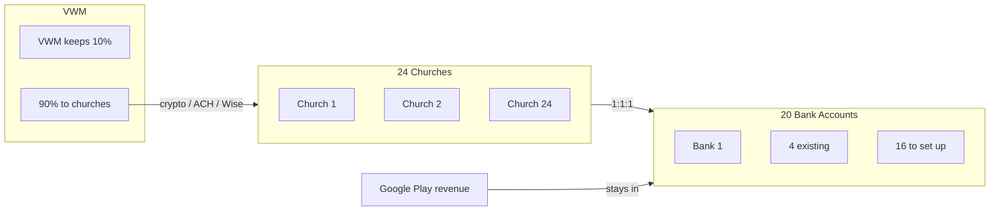

# Church Payout and Bank Account Governance

**Not legal or tax advice.** This document is operational governance only. It is not legal or tax advice. Churches and payees should consult their own advisors for legal, tax, and compliance matters.

---

## Purpose and scope

This doc is the governance source for **VWM→church payouts**, per-church **bank accounts** (Google Play), **treasurer control**, and **agreement requirements**. Google Play revenue remains in each brand's bank and is **not** part of this payout governance (see Bank account intent below).

---

## VWM payout split

Vishnu World Ministries (VWM) gives **90%** to churches as payouts; VWM keeps **10%**. Payouts to churches are made **from VWM** (not from the per-brand bank accounts that receive Google Play).

**Definition of the 90% basis:** State explicitly what the 90% is calculated on. Choose one and document it here:

- **Gross revenue** — 90% of gross (before any fees), or
- **Net after platform/payment processor fees** — 90% of amount after platform (e.g. Google Play) and payment processor fees only, or
- **Net after all fees** — 90% of amount after all applicable fees.

*Example placeholder: "90% is based on **net after platform/payment processor fees** unless otherwise agreed in the church agreement."* Update this sentence to match your chosen basis so there is no ambiguity.

---

## Payout cadence and cutoff

- **Cadence:** e.g. monthly (or as agreed in church agreement).
- **Cutoff date:** Date for inclusion in a given payout (e.g. last business day of month). Transactions after cutoff roll to the next period.
- **FX handling date:** If payouts involve FX (e.g. to non-USD recipients), state whether the rate is as of cutoff date or as of execution date. Document so operators and partners know the rule.

*Example: "Payouts run monthly. Cutoff: last business day of month. FX rate: as of execution date."*

---

## Dispute and correction policy

How to handle **underpayment**, **failed payout**, and **reversal**:

- **Who to contact:** Treasurer (or designated contact).
- **Required evidence:** Transaction ID, amount expected, date, and any provider error message or screenshot.
- **Timeline:** Report within **30 days** of expected payout date. Treasurer corrects or re-pays within **X business days** (specify, e.g. 10) after evidence is received.
- **Escalation:** If not resolved, escalate per church agreement or designated process.

Keep records of all disputes and corrections for the audit trail (see Record retention below).

---

## Approval controls

- **Who can change payee method or account:** Treasurer plus one other designated role (e.g. board member or operations lead). No single-person changes to payout method or account/vault_ref.
- **2-person approval required for:**
  1. Changing a payee's payout method or account (vault_ref).
  2. First payout to a new payee.

Operational steps: see [config/payouts/CHECKLIST.md](../config/payouts/CHECKLIST.md) and [docs/PAYOUT_PARTNER_METHODS.md](PAYOUT_PARTNER_METHODS.md).

---

## Sanctions / AML / KYC

**Non-US payouts:** Screening (sanctions lists, AML/KYC as required by provider or jurisdiction) must be completed **before first payout** and when required by provider or policy. No payouts to sanctioned parties or where screening fails. This is a condition for using crypto, ACH, or Wise for international corridors. Document screening steps in your runbook or provider docs; do not store sensitive screening results in repo.

---

## Record retention and audit trail

- **How long:** Retain docs and logs per your jurisdiction (e.g. **7 years** for financial records). Update if your jurisdiction requires a different period.
- **What to retain:** Payout logs, approval records (who approved method change or first payout), method-change audit trail, dispute/correction records.
- **Audit trail:** Any change to payee method or account (vault_ref) must be logged with date and approvers.

---

## Entities and counts

- **24 churches/payees.** Each church = one payee for the 90% payout.
- **20 bank accounts** required. **4 churches** already have bank accounts; **16** to be set up.

---

## 1:1:1 mapping

One **church** (church YAML + brand_id) = one **Google Play developer account** = one **bank account**. Treasurer controls all such bank accounts. Treasurer provides each church with: bank account details, EIN, and wording/instructions for Google Play signup (unique person/address/bank per brand for Google compliance).

---

## Bank account intent

Accounts are for **receipt of Google Play revenue** (out of scope for this governance) and **wealth-building intent**; they are **not** for monthly payouts. Treasurer may move funds from a few accounts **2–3 times per year** at most. A **letter to the bank** describing low-activity / wealth-building intent is recommended so the bank understands the use case.

---

## How the 90% is paid

VWM pays the 90% share to each church/partner via **crypto**, **US bank-to-bank (ACH)**, or **Wise** (church/partner choice). Methods and compliance: [docs/PAYOUT_PARTNER_METHODS.md](PAYOUT_PARTNER_METHODS.md). Config: [config/payouts/payees.yaml](../config/payouts/payees.yaml) (schema v1.1).

---

## Church agreements (both required)

1. **Existing:** church_docs / Cooperative Church Compliance agreements (canonical church record, compliance calendar, etc.). See [docs/church_docs/README.md](church_docs/README.md).
2. **Additional:** Separate agreement covering: Google Play developer account setup and use, bank account control by treasurer, and VWM 90% payout terms (and, where applicable, letter to bank re low-activity intent).

**Church agreements = [existing Cooperative Church Compliance] + [VWM/Google Play/bank control/payout agreement].**

---

## Non-US partners (Japan, China, Taiwan)

- **US address:** Via **virtual mailbox** (e.g. Anytime Mailbox, iPostal1; ~$7–10/month).
- **Entity:** Unincorporated church with EIN for online bank (no state tax).
- **Personal tax:** The payee's responsibility; not VWM's withholding.

---

## Diagram

---

## References

- [docs/church_docs/README.md](church_docs/README.md) — Church–brand linkage, Cooperative Church Compliance
- [docs/adr/ADR-002-distribution-only-church-brand.md](adr/ADR-002-distribution-only-church-brand.md) — Distribution-only church brand policy
- [config/payouts/](../config/payouts/) — churches.yaml, payees.yaml, CHECKLIST.md
- [docs/PAYOUT_PARTNER_METHODS.md](PAYOUT_PARTNER_METHODS.md) — Partner payout methods (Wise, crypto, HK clearing), compliance gate, payees v1.1
