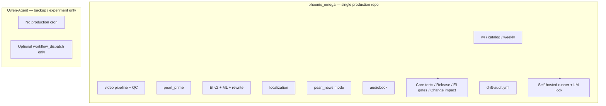

# GitHub Operations Framework

**Purpose:** Single place to map repos, workflows, triggers, secrets, and runners for **Ahjan108/phoenix_omega_v4.8** and **Ahjan108/Qwen-Agent** so GitHub operations are repeatable and error-free.

**You found this from:** [docs/DOCS_INDEX.md](./DOCS_INDEX.md) (task table: "Do GitHub operations (both repos)" or "For developers: start here"). Use this doc whenever you do PRs, merges, pushes, or runner/workflow work in either repo.

**Authority:** [DOCS_INDEX.md](./DOCS_INDEX.md). Related: [BRANCH_PROTECTION_REQUIREMENTS.md](./BRANCH_PROTECTION_REQUIREMENTS.md), [GITHUB_SUPPORT_SYSTEM_SPEC.md](./GITHUB_SUPPORT_SYSTEM_SPEC.md), [PEARL_NEWS_OPTION_B_RUNBOOK.md](./PEARL_NEWS_OPTION_B_RUNBOOK.md), [GITHUB_GOVERNANCE_INCIDENT_RUNBOOK.md](./GITHUB_GOVERNANCE_INCIDENT_RUNBOOK.md).

---

## Repo identity

| GitHub repo | Default branch | Local path | Note |
|-------------|----------------|------------|------|
| **Ahjan108/phoenix_omega_v4.8** | main | phoenix_omega | **Single production repo:** v4, video, pearl_prime, EI v2, ML, localization, pearl_news (assembly mode). phoenix_omega_v4.8 = this repo. |
| **Ahjan108/Qwen-Agent** | main | Qwen-Agent (sibling or elsewhere) | **Backup / experiment only.** After PR B: no production cron; workflow_dispatch only. Fork of QwenLM/Qwen-Agent. |

**Production rule:** phoenix_omega is the **only** production repo. Qwen-Agent is **dispatch-only** (no production traffic, no production writes). All production schedules and writes run from phoenix_omega.

**Backup freeze:** Backup repos (e.g. Qwen-Agent) are **frozen**: no schedule triggers, no production writes, manual dispatch only. See [QWEN_SAFE_CONSOLIDATION_SPEC.md](./QWEN_SAFE_CONSOLIDATION_SPEC.md) §4.

---

## Sync from canonical

**Rule:** Any shared runtime file may only be edited in the **canonical location** (phoenix_omega). Edits in Qwen-Agent to allowlisted or shared paths do **not** count as source of truth. When syncing or copying from Qwen-Agent, phoenix_omega is always the authority; do not treat Qwen-Agent as the place to make changes to shared code, config, or docs.

See [CANONICAL_EDIT_RULE.md](./CANONICAL_EDIT_RULE.md) and [QWEN_SAFE_CONSOLIDATION_SPEC.md](./QWEN_SAFE_CONSOLIDATION_SPEC.md).

## Local/GitHub drift prevention

Use [LOCAL_GIT_DRIFT_PREVENTION_SOP.md](./LOCAL_GIT_DRIFT_PREVENTION_SOP.md) as the mandatory daily branch workflow.

Quick rules:
- Branch from `origin/main` only.
- Never commit on local `main`.
- Never force-push `main`.
- Always compare local vs remote before risky push: `git rev-list --left-right --count origin/main...HEAD`
- Qwen-Agent is backup/manual dispatch only; production edits happen in phoenix_omega first.

---

## Monthly stable baseline and rollback runbooks

**Monthly baseline:** Tag a stable baseline from `main` once per month (e.g. first Monday after truth-audit passes). Use tag format `stable-YYYY-MM`. See [RELEASE_POLICY.md](./RELEASE_POLICY.md) § Monthly stable baseline.

**Rollback runbooks:** Keep rollback and DR runbooks current. Canonical index: [ROLLBACK_RUNBOOKS_INDEX.md](./ROLLBACK_RUNBOOKS_INDEX.md). Review the index monthly and on every release; update it in the same PR when a rollback script or doc changes.

---

## Remote-only commit review

A **weekly** workflow (`.github/workflows/remote-commit-review.yml`) lists commits on `main` from the last 7 days that were **not** made via a merged PR (e.g. direct push or merge without PR). The report is uploaded as an artifact; **triage within 24 hours**. Script: [scripts/audit/remote_commit_review.py](../scripts/audit/remote_commit_review.py).

---

## Architecture (overview)



---

## Workflow matrix: phoenix_omega_v4.8

| Workflow file | Name | Trigger | Runner | Required for branch protection? |
|---------------|------|---------|--------|----------------------------------|
| core-tests.yml | Core tests | push, PR to main | ubuntu-latest | Yes |
| release-gates.yml | Release gates | push, PR to main | ubuntu-latest | Yes |
| ei-v2-gates.yml | EI V2 gates | push, PR (path-filtered), schedule | ubuntu-latest | Yes |
| change-impact.yml | Change impact | push, PR to main | ubuntu-latest | Yes |
| teacher-gates.yml | Teacher gates | push, PR (path-filtered) | ubuntu-latest | Optional (path-filtered) |
| brand-guards.yml | Brand guards | push, PR (path-filtered) | ubuntu-latest | Optional |
| github-governance-check.yml | GitHub governance check | PR | ubuntu-latest | No |
| docs-ci.yml | Docs CI | push, PR | ubuntu-latest | No |
| simulation-10k.yml | Simulation 10k | schedule, dispatch | ubuntu-latest | No |
| marketing-config-gate.yml | Marketing Config Validation Gate | push, PR (path-filtered) | ubuntu-latest | No |
| production-observability.yml | Production observability | schedule, dispatch | ubuntu-latest | No |
| production-alerts.yml | Production failure alerts | schedule, dispatch | ubuntu-latest | No |
| auto-merge-bot-fix.yml | Auto-merge bot-fix | PR (labeled bot-fix) | ubuntu-latest | No |
| weekly-pipeline.yml | Weekly pipeline | schedule, dispatch | ubuntu-latest | No |
| ml-editorial-weekly.yml | ML Editorial weekly | schedule, dispatch | ubuntu-latest | No |
| ml-loop-continuous.yml | ML loop continuous | schedule, dispatch | ubuntu-latest | No |
| ml-loop-daily-promotion.yml | ML loop daily promotion | schedule, dispatch | ubuntu-latest | No |
| ml-loop-weekly-recalibration.yml | ML loop weekly recalibration | schedule, dispatch | ubuntu-latest | No |
| locale-gate.yml | Locale gate | push, PR | ubuntu-latest | No |
| translate-atoms-qwen-matrix.yml | Translate atoms (Qwen matrix) | schedule, dispatch | ubuntu-latest | No |
| research_feeds_ingest.yml | Research feeds ingest | schedule, dispatch | ubuntu-latest | No |
| pages.yml | pages build and deployment | push (e.g. main) | ubuntu-latest | No |
| audiobook_manual.yml | Audiobook manual | workflow_dispatch | self-hosted | No |
| audiobook_regression.yml | Audiobook regression | PR (path-filtered), dispatch | self-hosted | No |
| audiobook_scheduled.yml | Audiobook scheduled | schedule, dispatch | self-hosted | No |
| locale_max_agents.yml | Locale max agents | schedule, dispatch | self-hosted | No |
| pearl_news_scheduled.yml | Pearl News scheduled | schedule, dispatch | self-hosted | No |
| pearl_news_manual_expand.yml | Pearl News manual (expand) | workflow_dispatch | self-hosted | No |
| runner_artifacts_cleanup.yml | Runner artifacts cleanup | schedule, dispatch | self-hosted | No |
| catalog-book-pipeline.yml | Catalog book pipeline | schedule, dispatch | self-hosted | No |
| marketing-briefs-and-proposals.yml | Marketing briefs | schedule, dispatch | self-hosted | No |
| drift-audit.yml | Drift audit | schedule (daily 4am UTC), dispatch | ubuntu-latest | No |

**Branch protection (main):** Require **Core tests**, **Release gates**, **EI V2 gates**, **Change impact**, **truth-audit-gate**, **drift-gate**. See [BRANCH_PROTECTION_REQUIREMENTS.md](./BRANCH_PROTECTION_REQUIREMENTS.md). Machine-readable policy: [config/governance/required_checks.yaml](../config/governance/required_checks.yaml).
All changes to `main` must go through PRs; no force-push.

---

## Governance loops

- **PR-safe required gates:** [truth-audit-gate.yml](../.github/workflows/truth-audit-gate.yml), [drift-gate.yml](../.github/workflows/drift-gate.yml)
- **Full scheduled audits:** [system-truth-audit.yml](../.github/workflows/system-truth-audit.yml) (weekly), [drift-audit.yml](../.github/workflows/drift-audit.yml) (daily)
- **Remote-only commit review:** [remote-commit-review.yml](../.github/workflows/remote-commit-review.yml) writes weekly triage report to `artifacts/audit/remote_commit_review_*.{json,md}`; triage SLA 24h.
- **Required-check name drift prevention:** [scripts/ci/validate_required_checks_match.py](../scripts/ci/validate_required_checks_match.py) runs in [github-governance-check.yml](../.github/workflows/github-governance-check.yml).

---

## Monthly baseline

- Create monthly stable tags from green `main`: `stable-YYYY-MM` (or `baseline-YYYY-MM`).
- Keep rollback references current via [ROLLBACK_RUNBOOKS_INDEX.md](./ROLLBACK_RUNBOOKS_INDEX.md).

---

## Workflow matrix: Qwen-Agent (backup only — no production cron)

After PR B, all `schedule:` triggers are removed from Qwen-Agent. Only `workflow_dispatch` remains for manual backup runs.

| Workflow file | Name | Trigger | Runner | Secrets |
|---------------|------|---------|--------|---------|
| pearl_news_scheduled.yml | Pearl News scheduled | ~~schedule~~ → workflow_dispatch only | self-hosted | All 6 below |
| pearl_news_manual_expand.yml | Pearl News manual (expand) | workflow_dispatch | self-hosted | All 6 below |

**Secrets (Qwen-Agent):** WORDPRESS_SITE_URL, WORDPRESS_USERNAME, WORDPRESS_APP_PASSWORD, QWEN_BASE_URL, QWEN_API_KEY, QWEN_MODEL. These same secrets must also be configured in phoenix_omega (see below).

Branch protection: not specified; Qwen-Agent does not require status checks for main.

---

## Canonical ownership

| Feature / capability | Primary repo | Workflows | Notes |
|----------------------|--------------|-----------|--------|
| Phoenix (EI V2, Core, Release, Change impact, Teacher, Brand, ML loop, video, pearl_prime, v4, localization, Pearl News mode) | phoenix_omega_v4.8 | All workflows in phoenix_omega | **Single production repo.** Pearl News, audiobook, locale_max_agents run here. |
| Qwen-Agent | Qwen-Agent | Same workflow names | **Backup only.** After PR B: no production cron; workflow_dispatch only. See [OWNERSHIP_MATRIX.md](./OWNERSHIP_MATRIX.md). |

---

## Secrets and runners

### phoenix_omega_v4.8 (single production repo)

- **Secrets (required for migrated workflows):** WORDPRESS_SITE_URL, WORDPRESS_USERNAME, WORDPRESS_APP_PASSWORD, QWEN_BASE_URL, QWEN_API_KEY, QWEN_MODEL. Plus per-workflow tokens (observability, ML, production alerts). See workflow files and [AUTONOMOUS_IMPROVEMENT_AND_ML_SYSTEM.md](./AUTONOMOUS_IMPROVEMENT_AND_ML_SYSTEM.md).
- **Runner:** GitHub-hosted (ubuntu-latest) for CI/gate workflows. **Self-hosted** for Pearl News, audiobook, localization, catalog, marketing, and runner cleanup workflows. Self-hosted runner path: `$HOME/actions-runner/`. Start: `cd ~/actions-runner && ./run.sh`. Ensure LM Studio is running when workflows use `--expand` or LLM calls.
- **LM Studio lock:** `scripts/lm_studio_lock.py` (canonical location). All heavy workflows acquire/release this lock. Concurrency groups prevent overlap.

### Qwen-Agent (backup only)

- **Secrets (6):** Same as phoenix_omega (WORDPRESS_*, QWEN_*). Already configured.
- **Runner:** Same self-hosted runner. After PR B, no production cron — manual dispatch only.
- **Freeze:** Backup repos are frozen: no schedule triggers, no production writes, manual dispatch only.

---

## System functions (procedures)

### Standard PR flow (phoenix_omega)

1. Branch from `origin/main`: `git fetch origin && git checkout -b codex/<topic> origin/main`
2. Make changes, then run preflight: `scripts/ci/preflight_push.sh` (if present)
3. Commit, push branch: `git add -A && git commit -m "<type>: <scope>" && git push -u origin codex/<topic>`
4. Open PR to main; wait for required checks (Core tests, Release gates, EI V2 gates, Change impact); merge.

All changes to `main` must go through a PR. Paths `workflows/`, `scripts/`, `config/`, and `docs/` are CODEOWNERS-protected. See [GITHUB_SUPPORT_SYSTEM_SPEC.md](./GITHUB_SUPPORT_SYSTEM_SPEC.md) §5–6.

### Start-of-session safe sync

```bash
cd /path/to/phoenix_omega
git fetch origin
git checkout main
git reset --hard origin/main
git checkout -b codex/<topic>-<yyyymmdd>
```

If you have local changes, stash before reset:

```bash
git stash push -u -m "wip-before-main-sync"
```

### Merge to main when local main is behind

If you committed on a feature branch and pushed, but merging to main fails because local main is behind remote:

```bash
cd /path/to/phoenix_omega
git checkout main
git pull origin main
git merge codex/<your-branch> -m "Merge codex/<your-branch>: <short description>"
git push origin main
```

Or push your branch and merge via GitHub PR; then locally: `git checkout main && git pull origin main`.

### Push to Qwen-Agent (backup only)

When changing only Qwen-Agent backup workflows/docs:

1. Confirm you are in the Qwen-Agent repo and on main (or the branch you intend to push).
2. `git pull origin main` (avoid rejected push).
3. `git add <files> && git commit -m "<message>" && git push origin main`.
4. Do not add production schedules or production write paths in Qwen-Agent.

### Start self-hosted runner

On the machine where LM Studio runs (serves both phoenix_omega and Qwen-Agent workflows):

```bash
cd ~/actions-runner
./run.sh
```

Or use the watchdog: `scripts/runner/install_watchdog_launchd.sh` (checks every 5 minutes, auto-restarts). Run in background or a dedicated terminal. Keep LM Studio running for workflows that use LLM expansion.

### Runner _diag "file already exists" fix

If a workflow fails with `The file '.../actions-runner/_diag/pages/...log' already exists`:

1. Stop the runner (Ctrl+C or `./svc.sh stop`).
2. Clear diagnostic files:
   ```bash
   rm -rf ~/actions-runner/_diag/pages/*
   ```
   If the error persists, clear all: `rm -rf ~/actions-runner/_diag/*`
3. Start the runner again: `cd ~/actions-runner && ./run.sh`

Automated cleanup: `runner_artifacts_cleanup.yml` runs on schedule and cleans old diag/artifact files.

### Recovery: rejected push (non–fast-forward)

Do **not** force-push. Integrate remote changes then push:

```bash
git pull origin main
# resolve conflicts if any
git push origin main
```

For governance or ruleset issues, see [GITHUB_GOVERNANCE_INCIDENT_RUNBOOK.md](./GITHUB_GOVERNANCE_INCIDENT_RUNBOOK.md).

---

## Before you push (checklists)

### phoenix_omega

- [ ] Not on `main` (use a feature branch for changes).
- [ ] Branch name matches convention (e.g. `codex/<topic>`).
- [ ] Run `scripts/ci/preflight_push.sh` if available.
- [ ] No token or secret files staged.

### Qwen-Agent

- [ ] Confirm repo and branch (e.g. main if pushing directly).
- [ ] `git pull origin main` first if others may have pushed.
- [ ] No accidental phoenix-only files (e.g. from phoenix_omega) in the commit.

---

## Optional: machine-readable registry

A registry file [config/governance/github_repos_registry.yaml](../config/governance/github_repos_registry.yaml) (if present) lists repos, workflow file names, required checks, and expected secret names for scripts or tooling. The framework doc above is the human-readable source of truth.
