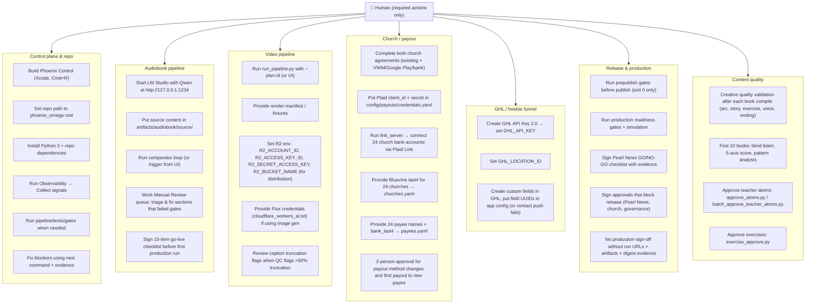

# Required Human Touchpoints — System-Wide

**Purpose:** Every place a human must touch the system for it to work. Optional steps are omitted.

---

## Visual: Where the human touches the system

---

## One-page table: Required human actions only

| Area | What the human must do |
|------|-------------------------|
| **Control plane** | Build Phoenix Control; set repo path; install Python + deps. Run Collect signals; run pipeline/tests/gates as needed; fix blockers using next command and evidence path. |
| **Audiobook** | Start LM Studio with Qwen at `http://127.0.0.1:1234`; put source content in `artifacts/audiobook/source/`; run pipeline (or UI); work Manual Review queue for failed sections; sign 10-item go-live checklist before first production run. |
| **Video** | Run `run_pipeline.py` with plan-id; provide render manifest/fixtures; set R2 env vars for distribution; provide Flux credentials if using image gen; review caption truncation when QC flags >50%. |
| **Church / payout** | Complete both church agreements; put Plaid credentials in `config/payouts/credentials.yaml`; run link_server and connect 24 bank accounts; provide 24 churches’ Bluevine last4 and 24 payees’ name + bank_last4; 2-person approval for payout method changes and first payout to new payee. |
| **GHL / freebies** | Set `GHL_API_KEY` and `GHL_LOCATION_ID`; create custom fields in GHL and put their UUIDs in app config so contact push works. |
| **Release** | Run prepublish gates (publish only when exit 0); run production readiness; sign Pearl News GO/NO-GO; sign all approvals that block release; retain run URLs + artifacts + digest for sign-off. |
| **Content quality** | Creative quality checklist after each compile; first 10 books evaluation; approve teacher atoms and exercises so content is eligible for use. |

---

## Authority

- Aggregated from [HUMAN_INTERACTIONS_REFERENCE.md](./HUMAN_INTERACTIONS_REFERENCE.md), [audiobook_operator_runbook.md](./audiobook_operator_runbook.md), [VIDEO_PIPELINE_SPEC.md](./VIDEO_PIPELINE_SPEC.md), [config/payouts/CHECKLIST.md](../config/payouts/CHECKLIST.md), [GO_LIVE_FINAL_CHECKLIST.md](./GO_LIVE_FINAL_CHECKLIST.md). Optional items (e.g. international partner payees, “when implemented” tabs, recommended tags) are omitted.
